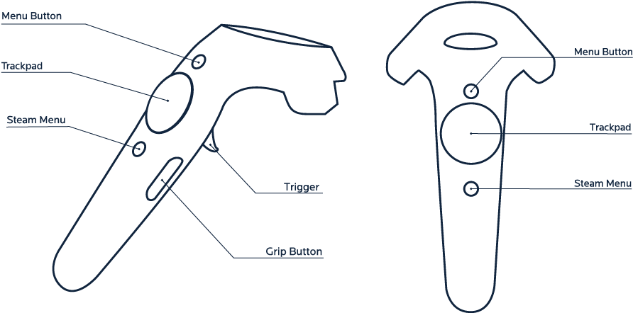

# VR Gun!

Hi, this simple project implements pistol shooting in **Unity** through a particle system using **SteamVR Plugin**.
The project was uploaded to GitHub for students in the VR/AR (IT Cube) direction, I hope it will benefit someone.

## Features
Weapon grip via Grip Button, firing via Trigger on controller.
When you click on Trigger, the gun starts firing a particle system and immediately causes damage to the enemy.
Enemy lives are indicated in a script in the inspector.


## How to use
After downloading, import the package into your Unity project. 
Find the gun and check the **Fire -> Fire Action - > GrabPinch script**.
Then add the **Enemy script** to the enemy and specify the amount of health in the inspector.

Done!!!

### Compatibility
- Unity 2022.3.20f1 (LTS)
- Built-In Render Pipeline (BIRP)
- SteamVR Plugin 2.8.0 (sdk 2.0.10)
- HTC Vive Pro 2 + Controller 2.0

## Files

```
- Assets:
	- Material:
		| - Black, Green, Blue, Red, Yellow; (standart materials)
	- Scenes:
		| - Bowling;
		| - SampleGun;
	- VRGun:
		| - Enemy.cs;
		| - Fire.cs;
		| - pistol1.fbx;
		| - prefab;
```
